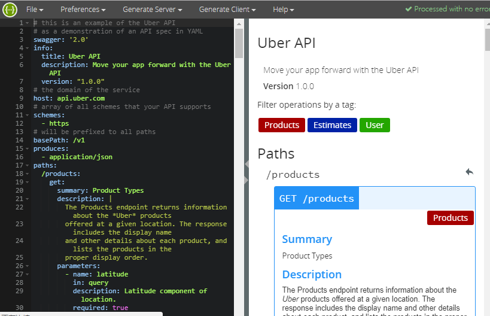

# Swagger Study
> swagger是一款编写API接口文档工具，它一个完全开源的项目，也是一个基于Angular的成功案例，我们可以下载源码并自己部署它，也可以修改它或集成到我们自己的软件中
## 安装使用 Swagger Editor
1. 安装node
2. 下载 [Swagger Editor](https://github.com/swagger-api/swagger-editor/releases/download/v2.10.4/swagger-editor.zip)，解压
3. 安装http-server ```npm install -g http-server```
4. 启动 swagger-editor ```http-server swagger-editor```
5. 浏览器访问 ```http://localhost:8080/```

```对于前端来讲，到这儿就可以```
6. 下载安装 [swagger ui](https://github.com/swagger-api/swagger-ui)
